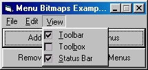



## Menu Bitmaps

### Description

Add 13x13 bitmaps to a menu by using Windows API.
 
### More Info
 
API and Parameter/Argument experience will be needed for this code.

             |
---                |---
**Submitted On**   |2000-09-30 15:16:14
**By**             |[Synthesize](https://github.com/Planet-Source-Code/PSCIndex/blob/master/ByAuthor/synthesize.md)
**Level**          |Intermediate
**User Rating**    |4.7 (14 globes from 3 users)
**Compatibility**  |VB 4\.0 \(32\-bit\), VB 5\.0, VB 6\.0
**Category**       |[VB function enhancement](https://github.com/Planet-Source-Code/PSCIndex/blob/master/ByCategory/vb-function-enhancement__1-25.md)
**World**          |[Visual Basic](https://github.com/Planet-Source-Code/PSCIndex/blob/master/ByWorld/visual-basic.md)
**Archive File**   |[CODE\_UPLOAD1176811172000\.zip](https://github.com/Planet-Source-Code/synthesize-menu-bitmaps__1-12858/archive/master.zip)

